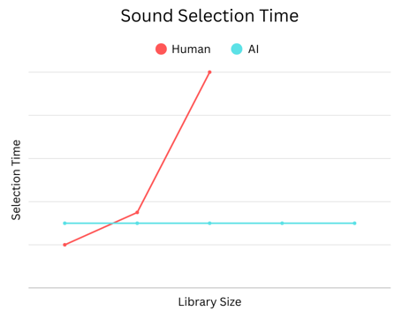

<!-- LICENSE HEADER MANAGED BY add-license-header

Copyright (C) 2025 Ethorbit

This file is part of SoundPrompt.

SoundPrompt is free software: you can redistribute it and/or
modify it under the terms of the GNU General Public License
as published by the Free Software Foundation, either version 3
of the License, or (at your option) any later version.

SoundPrompt is distributed in the hope that it will be useful,
but WITHOUT ANY WARRANTY; without even the implied warranty of
MERCHANTABILITY or FITNESS FOR A PARTICULAR PURPOSE.
See the GNU General Public License for more details.

You should have received a copy of the
GNU General Public License along with SoundPrompt.
If not, see <https://www.gnu.org/licenses/>.
-->

# SoundPrompt
## Your sounds, triggered by AI

SoundPrompt is a tool that plays your prerecorded audio files with AI prompts. It can enhance podcasts, live streams, online calls, and pranks / trolling by adding dynamic elements like music, sound effects, and custom audio cues to engage an audience or inject humor.

### Get Started
[Installation](https://github.com/Ethorbit/SoundPrompt/wiki/Installation) | [Usage](https://github.com/Ethorbit/SoundPrompt/wiki/Usage)

## Soundboard: a relic of the past!

Using mechanical or software controls to trigger sounds is an unintuitive process that requires practice and scales horribly. SoundPrompt solves these problems by utilizing the power of Artificial Intelligence and modern hardware to play the sounds you want, faster than you ever could.
